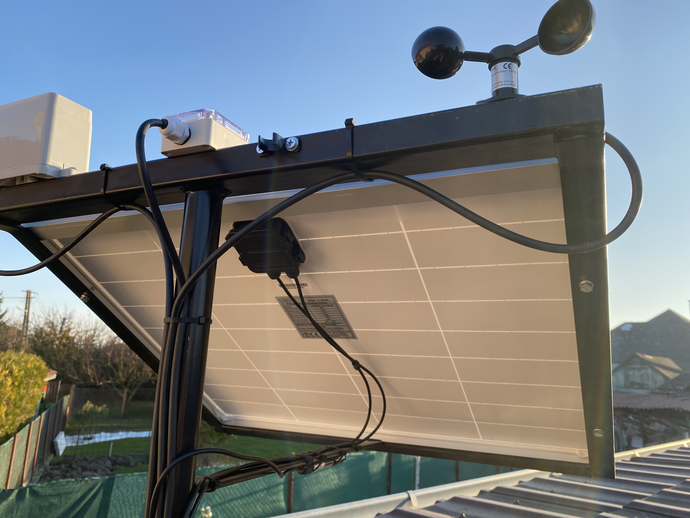
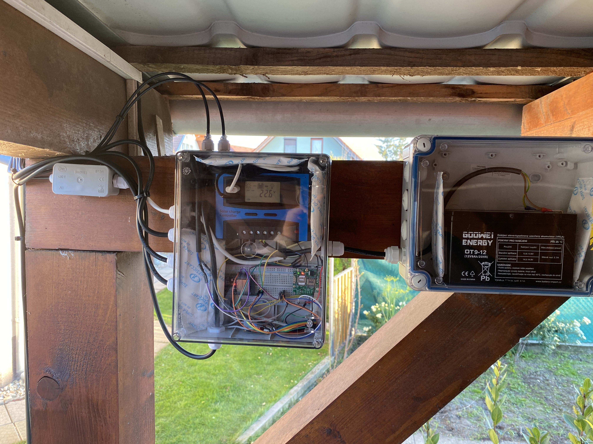
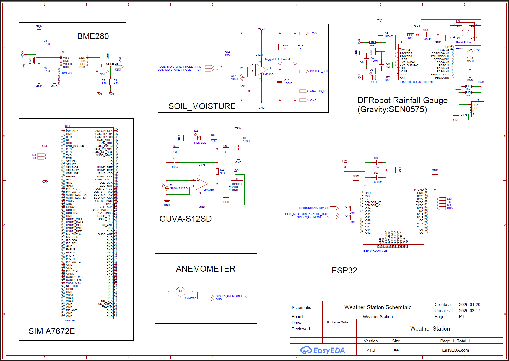

# 🌦️ Solar Powered IoT Weather Station


## 📌 Project Overview

This project is a **solar-powered IoT weather station** built using an **ESP32 microcontroller**.  
It collects real environmental data from multiple sensors, stores it in a database, and visualizes it through a modern web-based dashboard.

The system is a complete **end-to-end IoT solution**, covering hardware, firmware, backend, database, and frontend.

---

## 🧱 Physical Construction & Hardware

### ☀️ Outdoor Installation



The weather station is installed outdoors and powered entirely by a **solar panel**, making it fully autonomous and independent from grid power.

Mounted components:
- Solar panel
- Wind speed sensor (anemometer)
- Weather-resistant sensor housings

---

### 🔋 Power Supply & Electronics



The internal electronics are placed in sealed enclosures and include:
- Solar charge controller
- 12V rechargeable battery
- ESP32 microcontroller
- Voltage regulation and wiring

The system is designed for **continuous, long-term operation**.

---

## 🌡️ Measured Parameters

The weather station measures and stores the following data:

- Temperature (°C)
- Humidity (%)
- Air pressure (hPa)
- Rainfall (mm per hour)
- UV Index (0–11)
- Wind speed (km/h)
- Soil moisture (%)

All measurements are timestamped and permanently stored.

---

## 🧭 System Architecture

[Sensors]
↓
[ESP32]
↓ HTTP POST (JSON)
[ASP.NET Core Backend]
↓
[SQLite Database]
↓
[Web Dashboard]

---

## Schematic




---

## 🖥️ Web Dashboard

### 🏠 Main Dashboard


The main dashboard shows the **latest received weather data** using a card-based layout:
- Large, readable values
- Clear icons
- Visual UV index indicator
- Navigation to detailed charts

---

### 📊 Temperature Chart Example


Each sensor has its own interactive daily chart:
- Date selection
- Smooth animations
- Dark theme for readability

Charts are implemented using **Chart.js**.

---

### 📋 All Weather Data Table


All collected data can be viewed in a table with:
- Pagination
- Sorting
- Full historical dataset
- CSV export functionality

---

## ⚙️ Backend Implementation

### 🧩 Technologies Used
- ASP.NET Core
- Entity Framework Core
- SQLite
- REST API
- JSON communication

---

### 📦 WeatherData Model

```csharp
public class WeatherData
{
    public int Id { get; set; }
    public string Date { get; set; }
    public string Time { get; set; }
    public float Temperature { get; set; }
    public float Humidity { get; set; }
    public float Pressure { get; set; }
    public float RainfallLastHour { get; set; }
    public int uvIndex { get; set; }
    public float WindSpeed { get; set; }
    public int SoilMoisture { get; set; }
}
```

### 🌐 API Endpoints
Method	Endpoint	Description
POST	/WeatherReport/ReceiveData	Receives sensor data from ESP32
GET	/WeatherReport/GetAllReceivedData	Returns all stored data
GET	/WeatherReport/GetTemperatureData	Temperature data
GET	/WeatherReport/GetHumidityData	Humidity data
GET	/WeatherReport/GetPressureData	Pressure data
GET	/WeatherReport/GetRainfallData	Rainfall data
GET	/WeatherReport/GetUVIntensityData	UV index data
GET	/WeatherReport/GetWindSpeedData	Wind speed data
GET	/WeatherReport/GetSoilMoistureData	Soil moisture data

---

### 🔌 ESP32 Firmware

The ESP32 firmware:

Reads all connected sensors

Packages measurements into a JSON array

Sends data to the backend using HTTP POST

Supports stable, long-term autonomous operation

Example payload:
```
[
  {
    "Date": "2025-01-07",
    "Time": "13:00:00",
    "Temperature": 5.41,
    "Humidity": 80.33,
    "Pressure": 997.06,
    "RainfallLastHour": 0,
    "uvIndex": 0,
    "WindSpeed": 0,
    "SoilMoisture": 45
  }
]
```
---

### 🎨 User Interface

Dark theme

Bootstrap layout

Font Awesome icons

Fully responsive design

Optimized for desktop and mobile use

---

### ✅ Key Features

Solar powered

Fully autonomous operation

Real sensor data

Persistent database storage

Interactive charts

CSV export

Modular backend architecture

Easily expandable system

---

### 🚀 Possible Future Improvements

Alerts and notifications

Cloud deployment

Multiple weather station support

MQTT communication

Weather prediction algorithms
